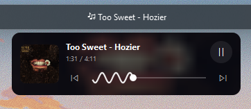
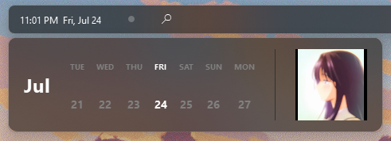
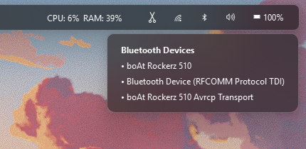
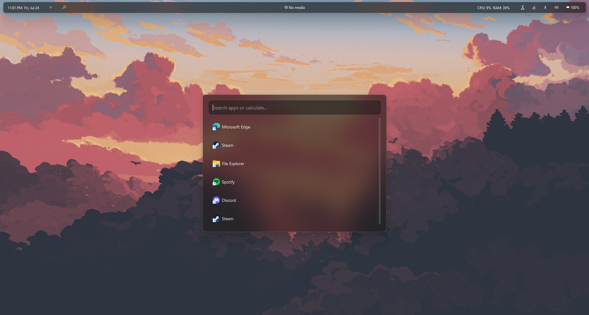

# 🪟 WINbar

<p align="center">
  
  
  
  
</p>

An elegant, highly customizable, and fluid status bar for Windows inspired by Linux's **Waybar**. Built with **PyQt6** and integrated deeply with Windows native APIs, **WINbar** behaves like a native desktop appbar—reserving space on your screen and providing beautiful acrylic blur effects, live system monitoring, virtual desktop integration, and interactive widgets.

---

## ✨ Features

*   **🧱 Native Windows AppBar Integration:** Registers with the Windows Shell (via `SHAppBarMessage`) to act as a desktop appbar. It docks at the top of the screen and automatically forces other windowed applications to respect its boundaries.
*   **🌀 Acrylic & Aero Blur Effects:** Integrates with Windows composition APIs (`SetWindowCompositionAttribute`) to enable modern semi-transparent blur/acrylic effects for popups and menus.
*   **💻 Virtual Desktop Workspaces:** Real-time tracking and switching of Windows 10/11 Virtual Desktops utilizing `pyvda`. Displays workspace indicators similar to iOS page dots.
*   **🎵 Media Integration (SMTC):** Connects to Windows Global System Media Transport Controls (SMTC). Fetches real-time playback state, artist details, track title, and album art thumbnail. Includes an **interactive animated wave seekbar**!
*   **📅 Dynamic Clock & Calendar Popup:** A clock widget that reveals a slick calendar dashboard with sliding animations on hover. Features a loopable circular video player.
*   **📊 System Resource Monitor:** Real-time feedback on CPU and Memory (RAM) utilization.
*   **🎛️ Gesture-based Controls:**
    *   **Volume Adjustment:** Scroll your mouse wheel up/down over the volume icon capsule to adjust the Windows master system volume in 2% steps (via `pycaw`).
    *   **Brightness Adjustment:** Scroll your mouse wheel up/down anywhere over the main bar background area to dynamically adjust screen brightness in 5% steps (via PowerShell WMI bindings).


---

## 📸 Screenshots

### 🎵 Media Controller & Seekbar
Interactive media player widget fetching real-time Windows SMTC data (artist, title, cover art) with an animated wave seekbar:
<p align="center">
  
</p>

### 📅 Calendar Widget & Loopable Video Player
Clock hover popover featuring a complete iOS-style weekly calendar and a loopable circular video window:
<p align="center">
  
</p>

### 🌐 System Connection & Popups
Glossy acrylic popup displaying current Wi-Fi/Ethernet network details and Bluetooth devices status:
<p align="center">
  
</p>

### 🔍 App Launcher Search Dashboard
Search dashboard to quickly query applications, run system commands (like lock screen, sleep, shutdown), and perform calculations:
<p align="center">
  
</p>

---

## 🛠️ Tech Stack & Architecture

WaybarWin is composed of several modular Python scripts:

*   [`main.py`](file:///c:/Users/raj2005sriv/Desktop/Raj%20Prsnl/skill/waybar-win/main.py): Launches the application, manages multi-display screen detection, and instantiates the bars.
*   [`bar.py`](file:///c:/Users/raj2005sriv/Desktop/Raj%20Prsnl/skill/waybar-win/bar.py): Contains the core `WaybarWindow` layout and custom widgets (`WorkspacesWidget`, `SystemMonitorWidget`, `ClockWidget`, `WaveSeekBar`, `MediaPopupWidget`).
*   [`appbar.py`](file:///c:/Users/raj2005sriv/Desktop/Raj%20Prsnl/skill/waybar-win/appbar.py): Low-level ctypes bindings for registering the window as a native Windows AppBar.
*   [`theme.py`](file:///c:/Users/raj2005sriv/Desktop/Raj%20Prsnl/skill/waybar-win/theme.py): Theme engine managing colors, styles, and stylesheet loading.
*   [`build.py`](file:///c:/Users/raj2005sriv/Desktop/Raj%20Prsnl/skill/waybar-win/build.py): PyInstaller compilation helper.

---

## 🚀 Getting Started

### Prerequisites

Make sure you have **Python 3.10+** installed. You will also need standard build tools for Python on Windows.

### Installation

#### Via WinGet (Recommended)
You can install **WINbar** directly using the Windows Package Manager:
```cmd
winget install rajsriv.WINbar
```

#### From Source (Development)
1. Clone this repository:
   ```bash
   git clone https://github.com/raj2005sriv/waybar-win.git
   cd waybar-win
   ```

2. Install the required dependencies:
   ```bash
   pip install PyQt6 psutil pyvda winsdk
   ```

> [!NOTE]
> `winsdk` is required to integrate with the Windows System Media Transport Controls (SMTC) to read media titles and album art. `pyvda` requires the virtual desktop feature to be enabled on Windows.

### Running the Application

To start the status bar in development mode:
```bash
python main.py
```

To run it silently in the background (using VBS helper):
```bash
wscript run.vbs
```

---

## 📦 Compilation & Packaging

You can compile **WaybarWin** into a standalone `.exe` using **PyInstaller**. The repository includes a helper script [`build.py`](file:///c:/Users/raj2005sriv/Desktop/Raj%20Prsnl/skill/waybar-win/build.py) that packages the app windowed, cleans the build artifacts, embeds the version information, and attaches the video loop:

To compile the executable, run:
```bash
python build.py
```
The compiled output will be generated inside the `dist/WaybarWin/` directory.

---

## 🎨 Customization

You can customize the layout, colors, and font-families directly within [`theme.py`](file:///c:/Users/raj2005sriv/Desktop/Raj%20Prsnl/skill/waybar-win/theme.py):

*   **Palettes:** Adjust the `DARK_PALETTE` and `LIGHT_PALETTE` dictionaries to change font colors, backgrounds, accent colors, separators, and hover transitions.
*   **CSS Styles:** Customize stylesheets inside `get_theme_stylesheet()` using standard Qt QSS selectors.

---

## 📄 License

This project is licensed under the MIT License - see the [version_info.txt](file:///c:/Users/raj2005sriv/Desktop/Raj%20Prsnl/skill/waybar-win/version_info.txt) file or licensing headers for details.
